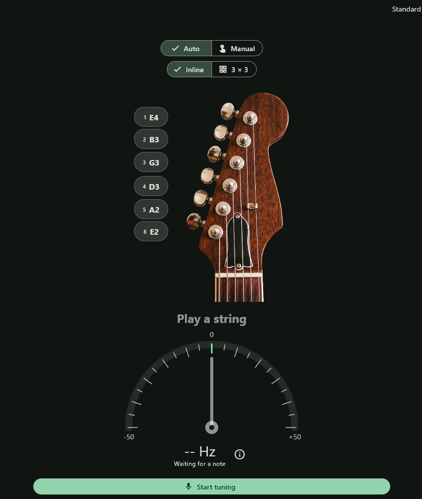
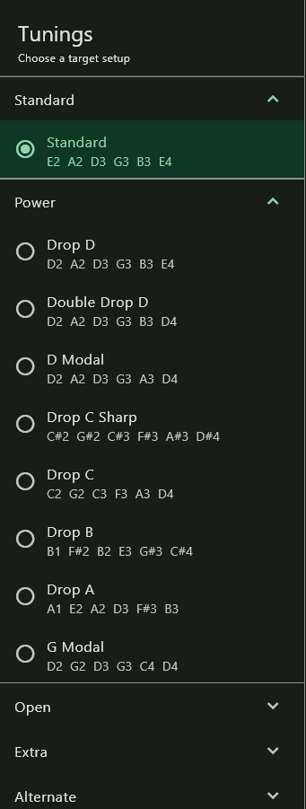

# Simple Tuner

A Flutter guitar tuner with real-time pitch detection, multiple tuning presets, and support for inline and 3+3 headstock layouts.

## Screenshots

### Tuner


### Inline headstock



### Tuning presets



## Run locally

```sh
cd simple_tuner
flutter pub get
flutter run
```
